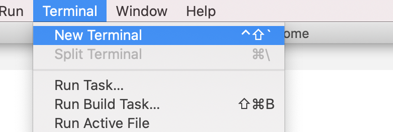
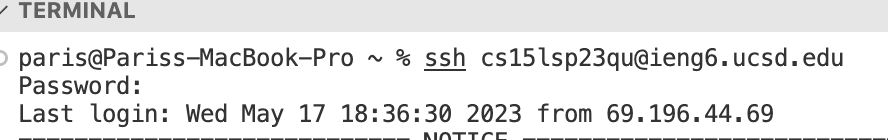
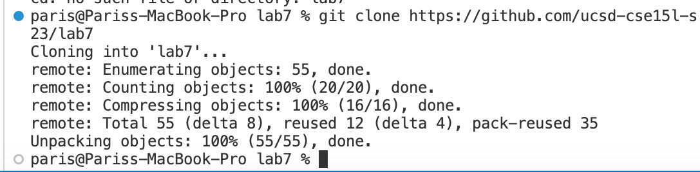
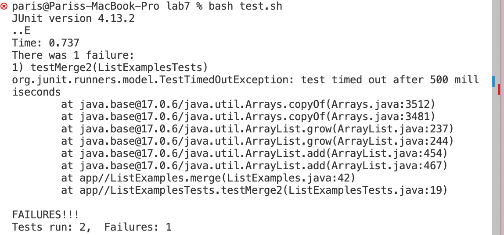
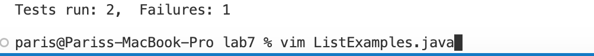
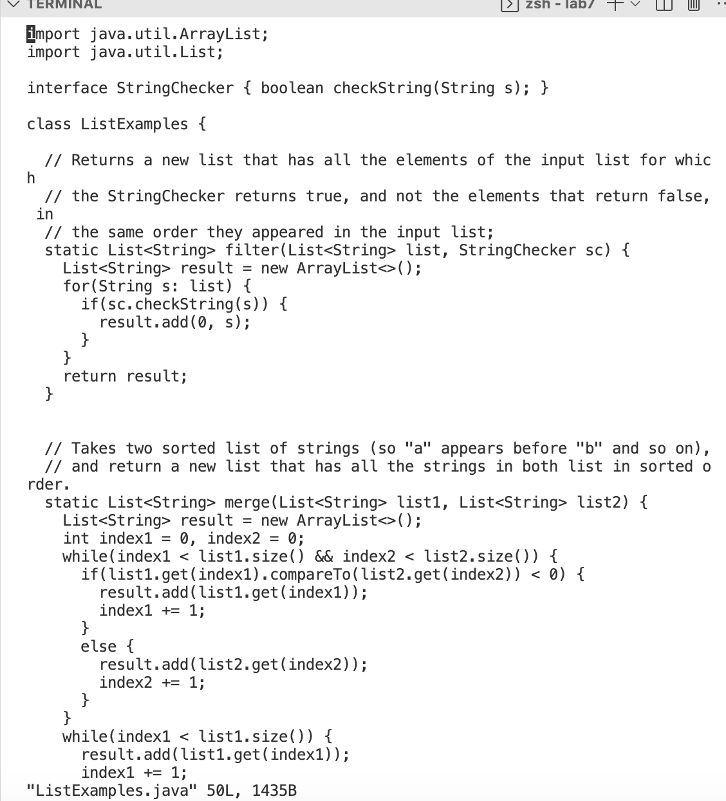
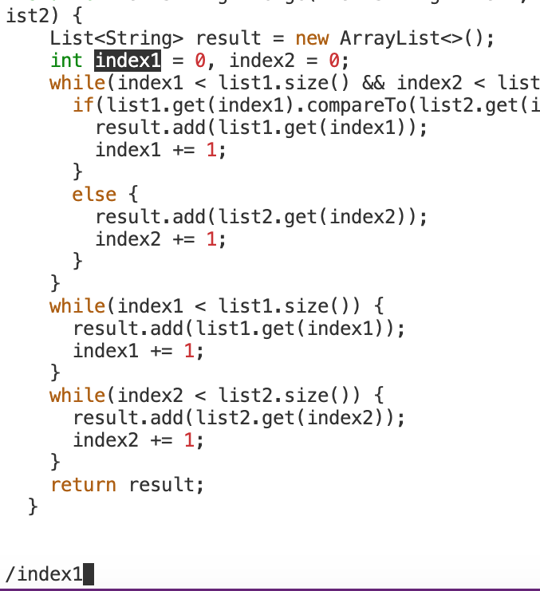
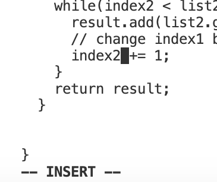
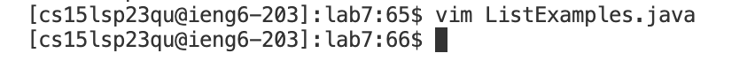
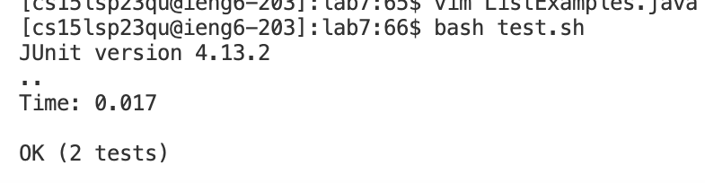

Lab Report 4
=========

This page will be going over the following steps:
1. Log into ieng6
2. Clone your fork of the repository from your Github account
3. Run the tests, demonstrating that they fail
4. Edit the code file to fix the failing test
5. Run the tests, demonstrating that they now succeed
6. Commit and push the resulting change to your Github account (pick any commit message!)

STEP 1: Log into ieng6
----
> Open up a new terminal in any coding space you will be working on
> 
> 
> where I typed `ssh <space> cs15lsp23qu@ieng6.ucsd.edu <enter>` and typed my password right after (no special characters)
> 
> 
> And now I have successfully logged in to ieng6 !

STEP 2: Clone repository from GitHub account
---
> In the same terminal I will be implementing this `git <space> clone https://github.com/ucsd-cse15l-s23/lab7 <enter>` 
> I used special cases such `ctrl- c` from a text of my class page to copy and `ctrl- v` to paste it in the terminal
> 
> which the terminal clarified that it successfully cloned the repository:
> 

STEP 3: Run the tests, demonstrating that they fail
---

>First I want to check if the code in the bash is working so I will be typing in the terminal `bash <space> test.sh <enter>`
>
>
> As you can see there is a failure in the code stored (in my file would be the one titled as `ListExamples.java`)

STEP 4: Fix the code in the file
----

> In order to fix the code I will be wanting to take a look at what the error could be. So in this case I will type `ls <enter>` in order to take a look at what I have 
> in my files
> Once I have an idea of which file I want to take a look at I will then type `vim <space> <file I want to take a look at>` 
> In my case I want to take a look at ListExamples.java so in the terminal I will type `vim ListExamples.java`
> 
> and it took me directly to the file I wanted to see:
> 
> 
> Now in this code my error has to do with changing a certain variable name to `index1` to `index2` and in order to quickly find it I will 
> be using `/<query><enter>` in order to easily find the word I want (its like a ctrl- f but for a terminal !)
> 
> 
> 
> (notice how it highlights the word that I am finding which will do everytime you press `n`)
> 
> Once you press enter in your keyboard you can continously press the letter `n` to go through all the words that contain the query you want in the code !
> 
> I had to press `n` 10 times in order to get to the last variable that I want to change
> Then to move around the word (which I have to get to the last letter of my word) I will be using the arrow keys to move to the righ `> > > > > >` 
> 
> Once I get to the letter or word that I want to change, I will press `i` to move to insert mode where I can easily type and change any words/letters etc
> Which I used `<delete>2` in order to delete 1 from the last letter of the word `index1` and change the 1 to 2
> 
> (The terminal will let you know if youre in insert mode or not) For example a little comment like this at the end of the terminal:
> 
> 
> If youre done editing and to change a different word in your code you can also press `esc` to leave insert mode and go back to normal mode
> Now in order to get back to the terminal you may type `:wq` this will save your progress and quit out into now the terminal:
> 
> 

STEP 5: Run the tests, demonstrating that they succeed
----

> Now that I have fixed my code I want to check if the tests will pass!
> In this case I will be using the same command of `bash <space> test.sh`
> 
> Which will clarify if I have passed my tests or failed:
> 
> 

STEP 6: Commit and push the resulting change to your Github account
---

>

